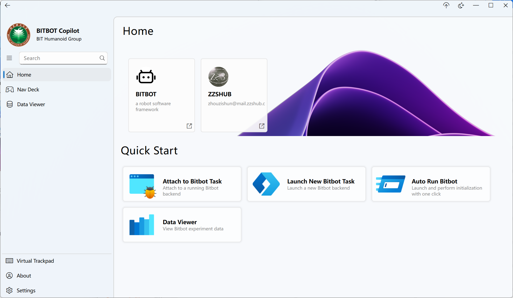

# Bitbot Copilot

Bitbot Copilot是一个[Bitbot](https://bitbot.lmy.name/)机器人控制框架的图形化前端程序。该程序支持使用键盘，手柄或触摸板来实时控制使用Bitbot后端的机器人，并支持实时数据绘制，历史数据查看等功能，以及远端机器人数据管理，自动初始化等高级功能。



# 安装

TBD...

# 数据查看

TBD...

# 远程数据管理

TBD...

# 手柄协议

手柄按键列表，收到的数需要缩放32768

手柄按键详细定义参阅[Xbox手柄文档](https://support.xbox.com/zh-CN/help/hardware-network/controller/get-to-know-your-xbox-series-x-s-controller)

|按钮|event_cmd|备注|
|---|---|---|
|A button|"GAMEPAD_BUTTON_A"|   |
|B button|"GAMEPAD_BUTTON_B"|   |
|X button|"GAMEPAD_BUTTON_X"|   |
|Y button|"GAMEPAD_BUTTON_Y"|   |
|Left Bumper|"GAMEPAD_BUTTON_LB"|   |
|Right Bumper|"GAMEPAD_BUTTON_RB"|   |
|Pad Left (D-pad)|"GAMEPAD_HAT_LEFT"|   |
|Pad Right (D-pad)|"GAMEPAD_HAT_RIGHT"|   |
|Pad Up (D-pad)|"GAMEPAD_HAT_UP"|   |
|Pad Down (D-pad)|"GAMEPAD_HAT_DOWN"| |
|left Joystick|"GAMEPAD_BUTTON_L_STICK"| |
|right Joystick|"GAMEPAD_BUTTON_R_STICK"| |
| (Switch) Button|"GAMEPAD_BUTTON_SWITCH"| |
|Share Button|"GAMEPAD_BUTTON_SHARE"|部分手柄可能无法接收该信号|
|Menu Button|"GAMEPAD_BUTTON_MENU"| |
|Xbox Button|"GAMEPAD_BUTTON_XBOX"|部分手柄可能无法接收该信号|
|left Trigger|"GAMEPAD_JOYSTICK_LT"| |
|Right Trigger|"GAMEPAD_JOYSTICK_RT"| |
|Left Joystick x-axis|"GAMEPAD_JOYSTICK_LX"| |
|Left Joystick y-axis|"GAMEPAD_JOYSTICK_LY"| |
|Right Joystick x-axis|"GAMEPAD_JOYSTICK_RX"| |
|Right Joystick y-axis|"GAMEPAD_JOYSTICK_RY"| |

手柄接收摇杆连续信号实例代码片段

```json
//在配置文件settings.json中添加摇杆事件
    {
      "event": "gamepad_yaw_move",
      "kb_key": "GAMEPAD_JOYSTICK_RX"
    },
```

```c++
//手柄事件回调函数
std::optional<bitbot::StateId> EventGamepadYawMove(bitbot::EventValue value, UserData& d)
{
    double vel = static_cast<double>(value/32768.0);
    std::cout<<"True Value"<<vel;
    return std::optional<bitbot::StateId>();
}

//注册回调函数
    kernel.RegisterEvent("gamepad_yaw_move", static_cast<bitbot::EventId>(UserCmdEvents::GamepadYawMove), &EventGamepadYawMove);
```
