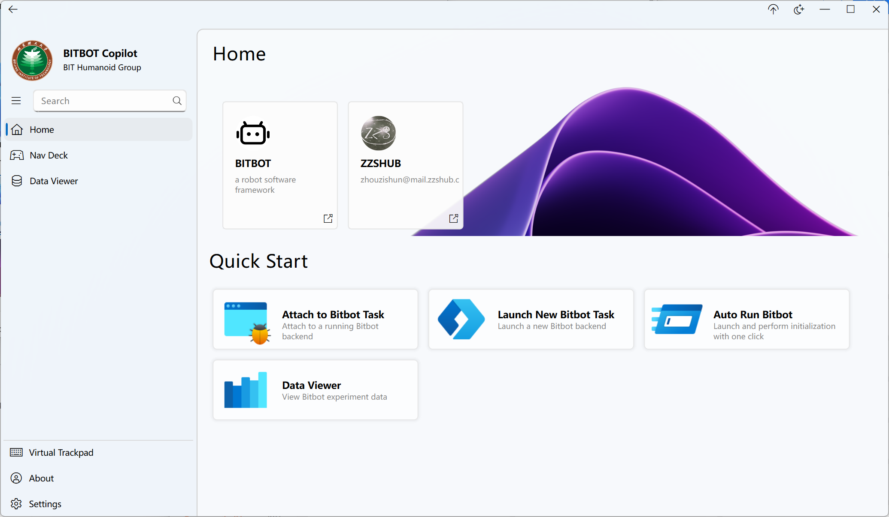

# Bitbot Copilot

Bitbot Copilot是一个[Bitbot](https://bitbot.lmy.name/)机器人控制框架的图形化前端程序。该程序支持使用键盘，手柄或触摸板来实时控制使用Bitbot后端的机器人，并支持实时数据绘制，历史数据查看等功能，以及远端机器人数据管理，自动初始化等高级功能。



# 快速使用

Bitbot Copilot 的推荐使用流程是先为机器人建立一个Profile或者选择左上角头像处已有的profile，再在 Profile 中配置前端连接、后端启动方式和数据目录，最后从 Home 页面进入控制或数据查看。

> **设置好profile后会记录ip/端口/路径等，方便长期使用，如果只是临时测试，也可忽略profile的设置，仅在Nav Deck(导航台)的 Frontend Manager(前端管理器)中填写机器人对应ip (本机仿真时填写127.0.0.1)并点击连接(Connect)来快速使用。** 

1. 打开程序后，点击左上角用户卡片或进入底部 `Settings`。
2. 在 `Robot Profiles` 中选择已有机器人，或点击 `Add new robot profile` 新增一个机器人配置。
3. 在 Profile 中填写 `Frontend manager`、`Backend manager`、`Dataviewer & database settings` 等配置并保存，**详细设置可参见下文 *机器人配置详细说明* 章节**。
4. 保存当前 Profile 后程序会重启，使新的连接和路径配置生效。
5. 回到 Home 页面，根据需要选择 `Attach to Bitbot Task`、`Launch New Bitbot Task`、`Auto Run Bitbot` 或 `Data Viewer`。

> 通过 Home 页面启动时，各入口含义如下：
> - `Attach to Bitbot Task`：只连接已经运行的 Bitbot 后端（本体和运控程序），不会启动新的后端进程。适合后端已经由终端、服务管理器或外部脚本启动的情况。大部分日常使用和调试场景都建议优先使用 `Attach`：机器人端程序通常已经由脚本或人工启动，Copilot 只需要接入它即可。
> - `Launch New Bitbot Task`：先按当前 Profile 的后端配置的一键启动脚本来启动一个新的 Bitbot 后端，再自动连接到 `Frontend manager` 中配置的 IP 和端口。只有希望 Copilot 通过本地进程或 SSH 帮你完全自动化启动机器人程序时才需要使用 `Launch`。


## 连接到机器人

`Frontend manager` 配置的是 Copilot 连接 Bitbot 后端控制服务的地址，也就是后端暴露给 GUI 的 HTTP/WebSocket 服务地址。

- `Frontend ip Address`：机器人后端控制服务所在主机，默认 `127.0.0.1`。
- `Frontend port`：机器人后端控制服务端口，默认 `12888`。
- 在 `Nav Deck` 页面也可以临时修改 IP 和端口，然后点击 `Connect` 连接。

`Frontend Manager` 只负责“连接已经存在的前端控制服务”，不会启动或关闭机器人本体程序。它适合日常调试中最常见的流程：先在机器人端或仿真端启动本体和运控程序，再回到 Copilot 填写 IP/端口并连接。

使用时可以按下面的方式理解：

- 本机仿真：通常填写 `127.0.0.1`，端口使用机器人程序实际监听的端口，默认一般是 `12888`。
- 远端机器人：填写机器人和电脑在同一网络下可访问的 IP，端口填写机器人程序暴露的前端控制端口。
- 临时连接：可以不改 Profile，直接在 `Nav Deck` 的 `Frontend Manager` 里填 IP/端口并点 `Connect`。
- 长期使用：建议在 Profile 中保存 `Frontend manager` 配置，之后切换到该 Profile 即可复用。

注意，`Frontend port` 不是 SSH 端口。SSH 端口属于 `Backend manager`，通常是 `22`，只用于远程启动后端、浏览远端 CSV 或下载数据。

连接成功后，Copilot 会读取机器人状态列表、可用控制指令和实时数据头，并通过 WebSocket 接收实时数据。此时可以在实时数据面板中查看机器人状态，和使用extra_data自定义的数据。

如果连接失败，请先检查：

- 机器人本体程序是否已经在运行。
- `Frontend ip Address` 和 `Frontend port` 是否对应后端控制服务，而不是 SSH 端口。
- 本机与机器人网络是否互通，防火墙是否放行对应端口。

## 管理多个机器人

Copilot 使用 Profile 管理多个机器人配置。每个 Profile 对应一个 `./profile/*.ini` 配置文件，里面包含该机器人的前端地址、后端启动方式、SSH 登录信息、数据目录和缓存设置。

- 在 `Settings` -> `Robot Profiles` 中可以新增、编辑或删除机器人 Profile。
- 点击左上角用户卡片可以快速切换当前机器人 Profile。
- 切换 Profile 或修改当前 Profile 后，程序会重启以加载新的配置。
- 当前版本一次只维护一个活跃机器人连接；如果要连接另一台机器人，请切换到对应 Profile 后重新启动连接流程。

## 后端配置与启动

`Backend manager` 配置的是 Copilot 如何一键启动机器人运控和本体程序，以及远程机器人通过 SSH 登录所需的信息。

- `Backend protocal` 选择 `local` 时，Copilot 会在本机启动程序，适合在仿真时使用。
- `Backend protocal` 选择 `ssh` 时，Copilot 会通过 SSH 连接远端机器人。
- `Backend ip Address`、`Backend port`、`Remote user name`、`Remote password` 只在 `ssh` 模式下使用，默认 SSH 端口是 `22`。
- `Executable path` 是后端可执行文件所在目录，例如 `/home/nvidia/`。
- `Executable name` 是后端可执行文件名，例如 `start_all.sh`。

通过 Home 页面启动时，各入口含义如下：

- `Attach to Bitbot Task`：只连接已经运行的 Bitbot 后端，不会启动新的后端进程。适合后端已经由终端、服务管理器或外部脚本启动的情况。大部分日常使用、调试和比赛场景都建议优先使用 `Attach`：机器人端程序通常已经由脚本或人工启动，Copilot 只需要接入它即可。
- `Launch New Bitbot Task`：先按当前 Profile 的后端配置启动一个新的 Bitbot 后端，再自动连接到 `Frontend manager` 中配置的 IP 和端口。只有希望 Copilot 通过本地进程或 SSH 帮你启动机器人程序时才需要使用 `Launch`。
- `Auto Run Bitbot`：在 `Launch New Bitbot Task` 的基础上，继续执行 Profile 中配置的自动初始化动作。该功能需要先配置 autorun commands。


当前 Copilot 内置的后端启动逻辑如下：

- 本地后端：在 `Executable path` 下启动 `Executable name`。
- 远程后端：通过 SSH 执行 `pkill -9 <Executable name>; cd <Executable path> && ./<Executable name>`，先结束同名进程，再进入目录启动新的后端。

如果你的机器人部署了额外的一键启动脚本，可以把脚本作为后端启动入口使用，或先在机器人终端中执行脚本，再使用 `Attach to Bitbot Task` 连接已有后端。外部脚本的具体命令请按实际部署补充，例如：

```bash
# 示例占位，请替换为真实脚本路径和参数
cd /path/to/bitbot/backend
./start_backend.sh
```


# 数据查看

`Data Viewer` 支持读取本地 CSV，也支持通过 SSH/SFTP 从远端机器人读取 CSV 格式的 log 数据。

读取本地 CSV：

1. 进入 Home 页面，点击 `Data Viewer`。
2. 点击加载按钮，选择 `Load Local File`,或者直接将带查看的csv文件拖拽进入Data Viewer。 
3. 选择本机上的 `.csv` 文件。
4. 文件加载后，可以在左侧数据树中选择曲线，在右侧图表中缩放、拖拽、框选或保存图表。

读取远端机器人 CSV：

1. 确认当前 Profile 的 `Backend protocal` 是 `ssh`，并已填写后端 SSH IP、端口、用户名和密码。
2. 在 `Dataviewer & database settings` 中设置 `Remote database`，例如机器人上保存实验数据的目录。
3. 如需保留下载文件，打开 `Enable local cache` 并设置 `Local cache path`。
4. 进入 `Data Viewer`，选择 `Load from Robot`。
5. 在远端文件选择器中浏览目录并双击 `.csv` 文件。
6. Copilot 会通过 SFTP 下载该文件到本地缓存目录，然后自动加载到图表中。

远端文件选择器主要用于 CSV 数据查看，普通文件不会作为可加载数据使用。若看不到期望文件，请确认文件扩展名为 `.csv`，并确认 `Remote database` 指向了正确的数据根目录。

# 机器人配置详细说明
### Frontend Manager(前端管理器)
- Frontend ip Address(前端IP地址):真机使用时机器人本体或仿真使用时本机的IP地址。
- Frontend port(前端端口): 数据传输协议的端口号，默认12888无需更改。

### Backend Manager(后端管理器)
- Backend protocal(后端协议)：启动一键脚本或者远程查看机器人数据时所使用的协议，可以选择本机或者ssh。
### Backend Connection(后端连接)
- Backend ip Address(后端ip地址)：机器人本体的SSH ip地址，一般和前端ip地址一致，用于远程启动一键脚本和读取远端CSV数据。
- Backend port(后端端口): SSH端口，默认22，一般无需修改。
- Remote user name(远程用户名): 机器人SSH用户名，例如`nvidia`或部署时约定的用户名。
- Remote password(远程用户密码): 机器人SSH用户密码，用于登录远端机器人。

### Backend executable(后端可执行文件)
- Executable path(可执行文件路径): 后端程序或一键启动脚本所在目录，例如`/home/nvidia/`。
- Executable name(可执行文件名称): 后端程序或一键启动脚本名称，例如`start_all.sh`。

### Dataviewer & database settings(数据查看器和数据库设置)
- Remote database(远程数据库路径): 机器人端保存CSV格式log的根目录，Data Viewer从机器人读取数据时会从这里开始浏览。
- Local cache path(本地缓存路径): 从机器人下载CSV文件时在本机保存的缓存目录，默认可使用`./cache`。
- Enable local cache(允许本地缓存): 是否保留下载到本机的CSV缓存；关闭后文件加载完成会删除本地临时文件。


# 手柄协议 (仅原生bitbot机器人支持)

手柄按键列表，收到的数需要缩放32768

手柄按键详细定义参阅[Xbox手柄文档](https://support.xbox.com/zh-CN/help/hardware-network/controller/get-to-know-your-xbox-series-x-s-controller)

|按钮|event_cmd|备注|
|---|---|---|
|A button|"GAMEPAD_BUTTON_A"|   |
|B button|"GAMEPAD_BUTTON_B"|   |
|X button|"GAMEPAD_BUTTON_X"|   |
|Y button|"GAMEPAD_BUTTON_Y"|   |
|Left Bumper|"GAMEPAD_BUTTON_LB"|   |
|Right Bumper|"GAMEPAD_BUTTON_RB"|   |
|Pad Left (D-pad)|"GAMEPAD_HAT_LEFT"|   |
|Pad Right (D-pad)|"GAMEPAD_HAT_RIGHT"|   |
|Pad Up (D-pad)|"GAMEPAD_HAT_UP"|   |
|Pad Down (D-pad)|"GAMEPAD_HAT_DOWN"| |
|left Joystick|"GAMEPAD_BUTTON_L_STICK"| |
|right Joystick|"GAMEPAD_BUTTON_R_STICK"| |
| (Switch) Button|"GAMEPAD_BUTTON_SWITCH"| |
|Share Button|"GAMEPAD_BUTTON_SHARE"|部分手柄可能无法接收该信号|
|Menu Button|"GAMEPAD_BUTTON_MENU"| |
|Xbox Button|"GAMEPAD_BUTTON_XBOX"|部分手柄可能无法接收该信号|
|left Trigger|"GAMEPAD_JOYSTICK_LT"| |
|Right Trigger|"GAMEPAD_JOYSTICK_RT"| |
|Left Joystick x-axis|"GAMEPAD_JOYSTICK_LX"| |
|Left Joystick y-axis|"GAMEPAD_JOYSTICK_LY"| |
|Right Joystick x-axis|"GAMEPAD_JOYSTICK_RX"| |
|Right Joystick y-axis|"GAMEPAD_JOYSTICK_RY"| |

手柄接收摇杆连续信号实例代码片段

```json
//在配置文件settings.json中添加摇杆事件
    {
      "event": "gamepad_yaw_move",
      "kb_key": "GAMEPAD_JOYSTICK_RX"
    },
```

```c++
//手柄事件回调函数
std::optional<bitbot::StateId> EventGamepadYawMove(bitbot::EventValue value, UserData& d)
{
    double vel = static_cast<double>(value/32768.0);
    std::cout<<"True Value"<<vel;
    return std::optional<bitbot::StateId>();
}

//注册回调函数
    kernel.RegisterEvent("gamepad_yaw_move", static_cast<bitbot::EventId>(UserCmdEvents::GamepadYawMove), &EventGamepadYawMove);
```
